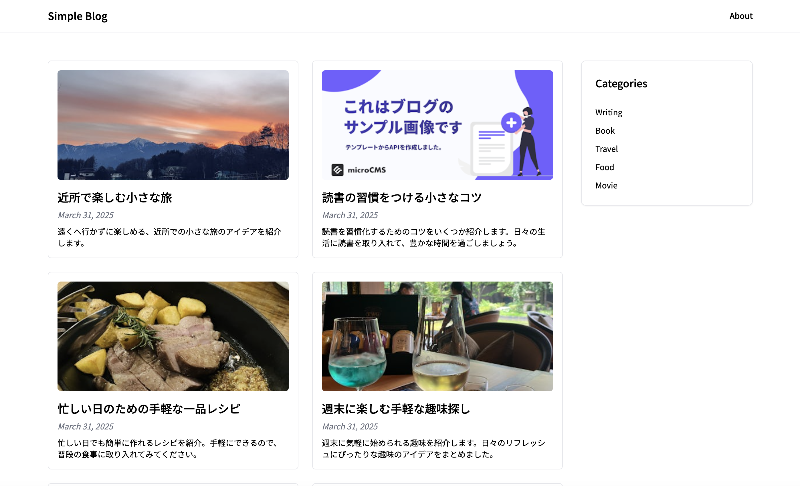
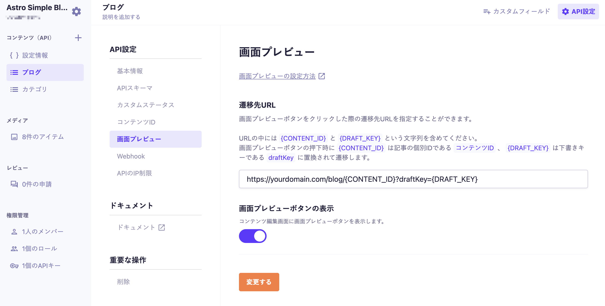

# Astroを使用したシンプルなブログ



Astroを使用したシンプルなブログのテンプレートです。

## 動作環境

Node.js 18 以上

## 環境変数の設定

ルート直下に`.env`ファイルを作成し、下記の情報を入力してください。

```
MICROCMS_API_KEY=xxxxxxxxxx
MICROCMS_SERVICE_DOMAIN=xxxxxxxxxx
```

`MICROCMS_API_KEY`  
microCMS 管理画面の「サービス設定 > API キー」から確認することができます。

`MICROCMS_SERVICE_DOMAIN`  
microCMS 管理画面の URL（https://xxxxxxxx.microcms.io）の xxxxxxxx の部分です。

## 開発の仕方

1. パッケージのインストール

```bash
npm install
```

2. 開発環境の起動

```bash
npm run dev
```

3. 開発環境へのアクセス  
   [http://localhost:4321](http://localhost:4321)にアクセス

## 画面プレビューの設定

下書き状態のコンテンツをプレビューするために、microCMS管理画面にて画面プレビューの設定が必要です。

ブログAPIの「API設定 > 画面プレビュー」に下記のように設定してください。  
※`yourdomain.com`は環境に合わせて置き換えてください。（localhost指定でも動作します）



設定後はコンテンツ編集画面にて画面プレビューボタンが利用可能になります。

## Vercelへのデプロイ

Vercelへデプロイする場合は、`@astrojs/vercel`をインストールし、`astro.config.mjs`にて以下を追加してください。

```javascript
import vercel from "@astrojs/vercel";

export default defineConfig({
  adapter: vercel(),
});
```
